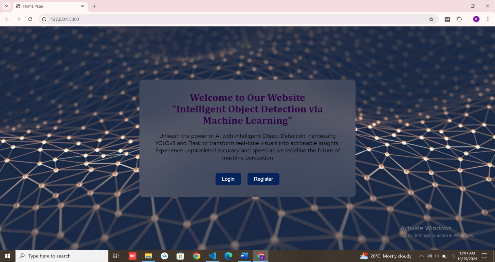
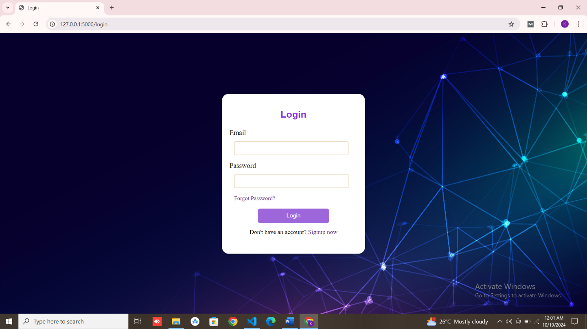
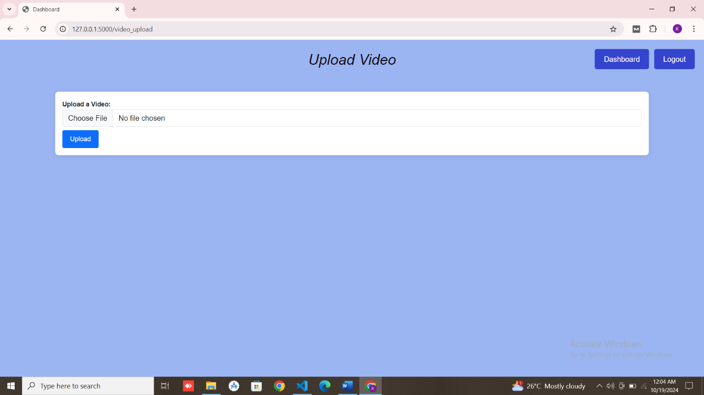
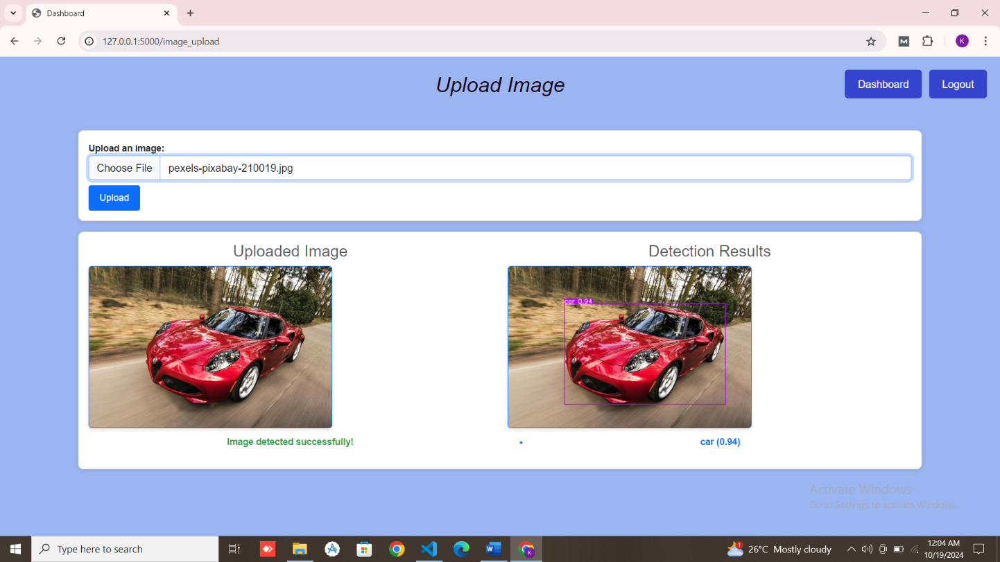

# 🔭 VisionScope – Intelligent Object Detection System

[](https://www.python.org/)  
[](https://flask.palletsprojects.com/)  
[](https://github.com/ultralytics/ultralytics)  
[](https://firebase.google.com/)  
[](#-license)

--- 
## 🧠 Overview
**VisionScope** is a Machine Learning-based object detection project that identifies and tracks real-world objects in both **images** and **videos**.  
Built using **YOLOv8**, **OpenCV**, and a **Flask web interface**, it allows users to upload images or videos and instantly detect multiple objects with real-time feedback.

---

## 🚀 Features

- 🎥 **Image & Video Object Detection** – Upload and analyze visual media.
- 🤖 **YOLOv8 Model Integration** – High-performance real-time object detection.
- 🌐 **Flask Web Interface** – Simple and responsive web app for interaction.
- 🔐 **Firebase Integration** – Secure authentication and data storage.
- ☁️ **Results Management** – Save and visualize detection outputs.
- 📈 **Expandable Architecture** – Easily add new detection models or analytics features.

---

## 🧰 Tech Stack
| Layer | Technologies Used |
|:--|:--|
| **Frontend** | HTML, CSS, JavaScript |
| **Backend** | Flask (Python) |
| **Machine Learning** | YOLOv8, OpenCV, NumPy |
| **Database & Auth** | Firebase |
| **IDE** | VS Code, Jupyter Notebook |
| **Environment** | Python venv |

---

## 📁 Project Structure
```

VisionScope/
│
├── 1_Data_Preparation/
│ └── dataset_ready/ # Dataset folder (excluded from repo)
│
├── 2_Training_predictions/
│ ├── yolo_train.ipynb # YOLOv8 training notebook
│ ├── data.yaml # Dataset config
│ └── train_results/ # YOLO training output (ignored in git)
│
├── Flask-web-app/
│ ├── app.py # Main Flask application
│ ├── best.pt # Trained YOLOv8 model
│ ├── firebase_config.py # Firebase configuration (excluded)
│ ├── object-detection-firebase-adminsdk.json # Firebase credentials(excluded)
│ ├── static/
│ │ ├── css/ # Stylesheets
│ │ ├── img/ # App images
│ │ └── results/ # Detection results
│ ├── templates/ # HTML templates
│ ├── uploads/ # Uploaded files
│ └── venv/ # Virtual environment (ignored)
│
├── yolo_venv/ # Optional YOLO training environment
│
├── requirements.txt
└── .gitignore


```

---

## ⚙️ Installation & Setup 

Follow these steps to set up **VisionScope** locally:

### 1️⃣ Clone the Repository

Start by cloning the repository using SSH:
```bash
git clone git@github.com:kalyani-pr/VisionScope.git
cd VisionScope
```

If you prefer HTTPS:
```bash
git clone https://github.com/kalyani-pr/VisionScope.git
cd VisionScope
```

### 2️⃣ Create and Activate a Virtual Environment

It’s recommended to use a virtual environment to manage dependencies.
```bash
python -m venv venv
venv\Scripts\activate        # On Windows
# source venv/bin/activate   # On Mac/Linux
```

### 3️⃣ Install Project Dependencies

Once the environment is active, install all required libraries from `requirements.txt`:
```bash
pip install -r requirements.txt
```

### 4️⃣ Download the Dataset

The dataset used for training and testing the **VisionScope** model is available externally to keep the repository lightweight.

You can download the prepared dataset from Google drive 
 👉 [Google drive link](https://drive.google.com/file/d/132uIz6Cg3TnhF4kNXl6WeIE0jAFwA0EV/view?usp=sharing)  

Once downloaded:
1. Move the file to your project directory under:

`1_Data_Preparation/`

Example:
```

VisionScope/
 ├── 1_Data_Preparation/
 │    └── dataset_ready/
```
2. Unzip it:

```python
unzip data_set_ready.zip -d 1_Data_preparation/
```

3. Update the data.yaml path (if needed) to point to the correct dataset directory.
Example:
```yaml
train: ../1_Data_preparation/train/images
val: ../1_Data_preparation/valid/images
nc: <number_of_classes>
names: ['class1', 'class2', ...]
```

> ⚠️ The dataset is not included in the repository due to size limitations.

### 5️⃣ Configure Firebase

This project uses **Firebase** for authentication and data storage.  
For security reasons, the actual credentials (`firebase_config.py` and `firebase_admin.json`) are **not included** in the repository.

To enable Firebase authentication and database features, follow these steps:

***🔹 Step 1: Create a Firebase Project***
1. Go to [Firebase Console](https://console.firebase.google.com/).
2. Click **“Add Project”** → Give your project a name (e.g., `object-detection`) and enable the following:
    - Firebase Authentication
    - Firebase Storage (optional)
    - Firebase Realtime Database / Firestore
3. Disable Google Analytics if you don’t need it → Click **Create Project**.

***🔹 Step 2: Add a Web App***
1. Inside your Firebase project, click **“Add App” → “Web”**.
2. Register your app (e.g., `VisionScopeApp`).
3. Firebase will generate your web configuration code.

***🔹 Step 3: Get Configuration Files***

You’ll need two files:
- `firebase_config.py`
- `object-detection-firebase-adminsdk.json`

**a) firebase_config.py**

Create a file in `Flask-web-app/` named `firebase_config.py` and paste your Firebase config snippet:
```python
firebaseConfig = {
  "apiKey": "YOUR_API_KEY",
  "authDomain": "YOUR_PROJECT_ID.firebaseapp.com",
  "projectId": "YOUR_PROJECT_ID",
  "storageBucket": "YOUR_PROJECT_ID.appspot.com",
  "messagingSenderId": "YOUR_SENDER_ID",
  "appId": "YOUR_APP_ID",
  "measurementId": "YOUR_MEASUREMENT_ID"
}
```

**b) object-detection-firebase-adminsdk.json**

From **Project Settings → Service Accounts → Generate New Private Key**, download the JSON file.
Rename it (if needed) to `object-detection-firebase-adminsdk.json` and place it inside:

`Flask-web-app/`

Example:
```
VisionScope/
 ├── Flask-web-app/
 │    ├── firebase_config.py
 │    ├── object-detection-firebase-adminsdk.json
 │    ├── app.py
 │    ├── templates/
 │    ├── static/
 │    └── ...
```

>⚠️ Both these files are ignored in .gitignore for security.  
Only example placeholders are included in the repository.

### 6️⃣ Run the Flask App
Navigate into the Flask app folder and start the server:
```bash
cd Flask-web-app
python app.py
```

You should see output like:
```csharp
 * Running on http://127.0.0.1:5000 (Press CTRL+C to quit)
 ```
 
### 7️⃣ Access the App
Open your browser and visit:
```cpp
http://127.0.0.1:5000
```

You can now:
- Upload images or videos for object detection
- View detection results
- Manage your session with Firebase authentication

### 8️⃣ Deactivate the Environment (Optional) 
After testing, deactivate your virtual environment:
```bash
deactivate
```

--- 

## 🧩 Troubleshooting

Here are common issues you might encounter and how to fix them:

| **Issue** | **Fix / Solution** |
|:--|:--|
| `ModuleNotFoundError: No module named 'cv2'` | Run `pip install opencv-python` |
| `ModuleNotFoundError: No module named 'ultralytics'` | Run `pip install ultralytics` |
| `firebase_admin.exceptions.InvalidArgumentError` | Ensure your Firebase JSON key is correctly placed inside `Flask-web-app/` |
| `OSError: [Errno 98] Address already in use` | Run the app on a different port: `python app.py --port 5001` |
| Missing YOLO weights (`best.pt`) | Copy `best.pt` into the `Flask-web-app/` directory |
| `AttributeError: module 'cv2' has no attribute 'dnn'` | Upgrade OpenCV: `pip install --upgrade opencv-python` |
| `ImportError: cannot import name 'app'` | Ensure you are inside the correct directory: `cd Flask-web-app` before running |
| Flask not starting | Verify the virtual environment is activated and dependencies are installed |


✅ You have now successfully set up and run VisionScope locally!  
If you encounter other issues, please open a GitHub issue or contact the repository maintainer.

---

## 📸 Screenshots

### 🔐 Authentication & Home Pages

| Homepage | Login | Signup | Forgot Password |
|-----------|--------|--------|-----------------|
|  |  |  |  |

### 🖼️ User Dashboard & Uploads

| Dashboard | Upload Image | Upload Video |
|------------|---------------|--------------|
|  |  |  |

### 🎯 Detection Result

| Object Detection Output |
|--------------------------|
|  |

--- 
## 🧠 Future Enhancements

Here are some ideas to extend and improve **VisionScope** in future versions:
- 🧠 **Model Optimization:**  
  Fine-tune the YOLOv8 model for higher accuracy and faster inference by experimenting with architectures and hyperparameters.
- 🎥 **Real-Time Video Detection:**  
  Improve the system’s ability to process live video streams efficiently by optimizing the Flask backend and data pipelines.
- 📱 **Cross-Platform Deployment:**  
  Expand deployment options to mobile and edge devices for flexible, on-the-go object detection.
- 🎨 **Enhanced User Interface:**  
  Design a more intuitive and visually engaging front-end for easier image/video uploads and interactive detection results.
- 🌐 **IoT & ML Integration:**  
  Integrate with IoT devices and other machine learning models to enable tracking, analytics, and predictive capabilities.

---

## 👩‍💻 Author & Credits

**Kalyani P R**  
📧 [kalyanipr.dev@gmail.com](mailto:kalyanipr.dev@gmail.com)  
🔗 [GitHub Profile](https://github.com/kalyani-pr)

Special thanks to the **Ultralytics YOLO** community and **OpenCV** developers for their tools that made this project possible.

---

## 🧾 License

This project is developed for educational purposes as a part of academics.  
You are free to fork and modify it for non-commercial use. 
